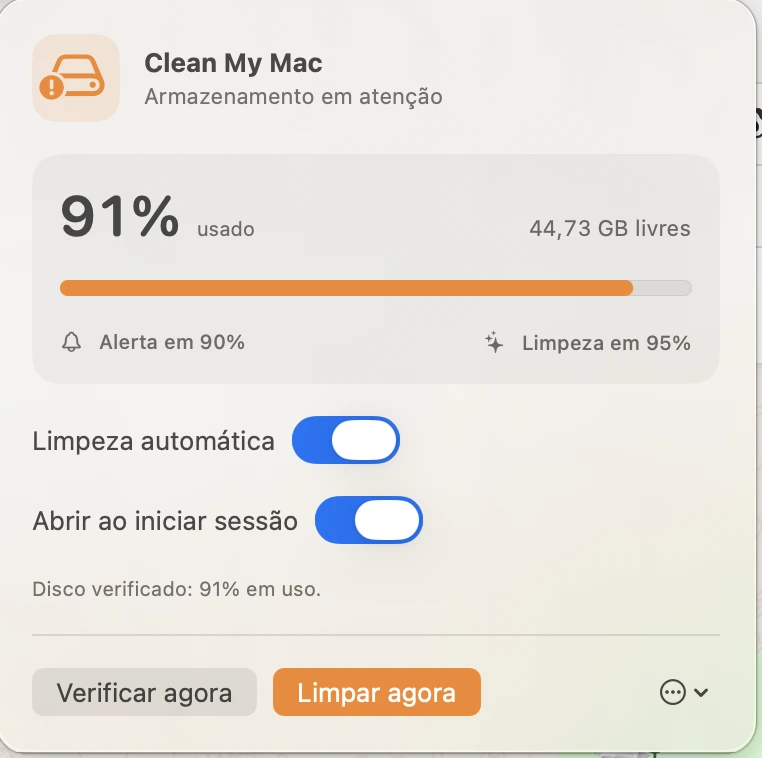

# Clean My Mac

**Autonomous SSD protection for people who build with Codex, Claude Code and coding agents.**

<p align="center">
  <a href="https://luisroquette.github.io/clean-my-mac/"></a>
  <a href="https://github.com/luisroquette/clean-my-mac/releases/latest"></a>
  <a href="LICENSE"></a>
  
</p>

Coding agents move fast, but parallel worktrees, dependency trees, builds and
tool caches can quietly consume the entire SSD. Clean My Mac watches the data
volume every minute, warns at 75%, and automatically cleans narrowly
allow-listed, regenerable development artifacts at 78%.

No account. No telemetry. No cloud service. Native SwiftUI, not Electron.



[Watch the 12-second product demo](docs/video/clean-my-mac-demo.mp4)

## Why it exists

Codex and Claude Code can leave several gigabytes behind after a task is done:
worktrees, `node_modules`, `.next` output and package-manager caches. Disk
pressure becomes visible only when the next build fails or an update stops.
Clean My Mac turns that AI-development failure mode into four guardrails:

1. **75% used:** visible menu-bar state and a macOS notification.
2. **78% used:** optional automatic cleanup of narrowly allow-listed data.
3. **80% used:** hard-limit alert if safe cleanup cannot recover enough space.
4. **Below 73%:** the warning rearms for the next storage cycle.

## Built for AI coding workflows

This is not a broad PC-maintenance utility. CCleaner and generic cleaners scan
the operating system; Clean My Mac focuses on the technical residue produced by
coding agents. It checks Git state, active development processes and a strict
allow list before removing artifacts that the project can rebuild.

Install it once, keep automatic cleanup enabled, and let your agents work. You
can also trigger the same safe cleanup with one click from the macOS menu bar.

## Safety contract

| It may remove | It never removes |
|---|---|
| npm, uv, Bun, Deno and Homebrew caches when those tools are installed | Documents, Desktop, Downloads, Photos, Music, Movies or Public folders |
| `node_modules` and `.next` directories of 100 MB or more | Git-tracked or non-ignored project content |
| Only generated folders inside a Git repository and ignored by Git | Artifacts belonging to an active Node/Python development process |
| Only after checking Git status before and after cleanup | Trash contents, Docker data, credentials, source files or external volumes |

Generated artifacts are deleted permanently to recover disk space. Every run is
recorded locally at `~/Library/Logs/CleanMyMac/clean-my-mac.log`.

## Install

Open the [download page](https://luisroquette.github.io/clean-my-mac/#download), complete the contact form, unzip the released file, and move **Clean My Mac.app** to Applications.

The free build is ad-hoc signed, not Apple-notarized. On first launch:

```bash
xattr -dr com.apple.quarantine "/Applications/Clean My Mac.app"
open "/Applications/Clean My Mac.app"
```

The prebuilt release targets Apple silicon and requires macOS 14 or later.

## Use

1. Find the disk icon in the top-right menu bar, beside Wi-Fi and the clock.
2. Leave **Automatic cleanup** enabled for the 78% preventive guard.
3. Leave **Open at Login** enabled for continuous monitoring.
4. Use **Check now** or **Clean now** whenever you want an immediate run.

The current app interface is in Brazilian Portuguese.

## Build from source

```bash
git clone https://github.com/luisroquette/clean-my-mac.git
cd clean-my-mac
./Scripts/preflight.sh
open "dist/Clean My Mac.app"
```

The project uses Swift 6, SwiftUI, AppKit and native macOS services. It has no
third-party runtime dependencies.

## Development roots

The generated-artifact scan is limited to `~/Projects`, `~/Projetos`,
`~/Developer`, `~/Code`, plus direct folders in the home directory that contain
either `.git` or `package.json`. Hidden folders and personal macOS folders are
excluded before traversal.

## Privacy

Storage samples, preferences and cleanup logs remain on the Mac. The app has no
analytics SDK, network client, account system or remote backend.

## Known limitations

- The 80% ceiling is best-effort: if safe regenerable data is insufficient, the app alerts instead of deleting personal files.
- The prebuilt release is Apple-silicon-only and not notarized.
- The interface is currently Brazilian Portuguese.
- Projects outside the documented roots are not scanned.
- Package caches are cleaned only when their command-line tools are installed.

## License

[MIT](LICENSE) © 2026 Luis Roquette.

---

Clean My Mac is an independent open-source utility. It is not affiliated with,
sponsored by, or endorsed by MacPaw. “CleanMyMac” is a trademark of its
respective owner.
